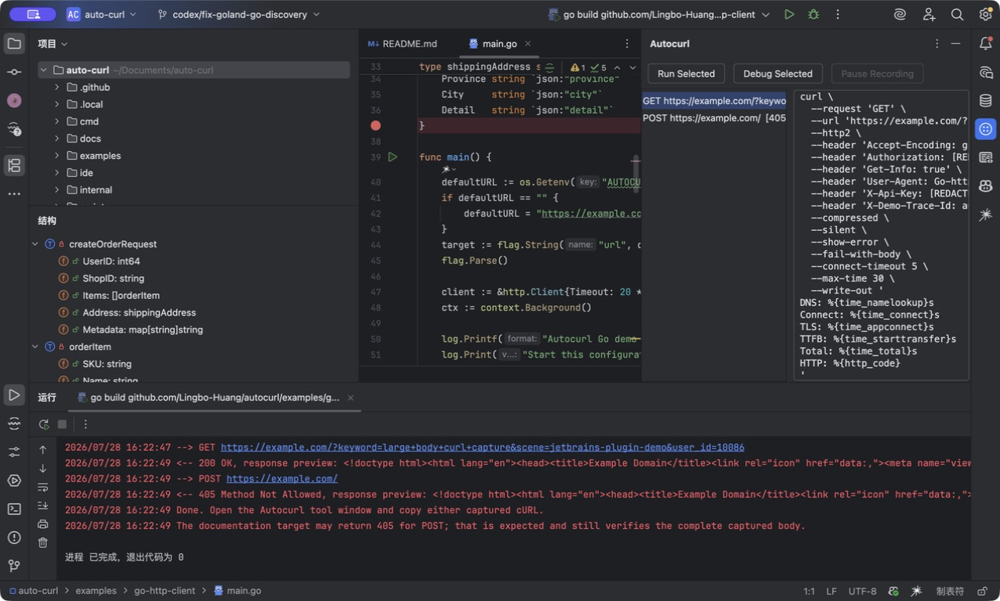

# autocurl 中文使用指南

[](https://github.com/Lingbo-Huang/autocurl/actions/workflows/ci.yml)
[](https://github.com/Lingbo-Huang/autocurl/releases)
[](LICENSE)

[English README](README.md)

[隐私说明](PRIVACY.md) · [支持与反馈](SUPPORT.md)

`autocurl` 是 IDE 原生、只作用于当前 Run/Debug 进程的出站请求捕获工具：
不修改业务代码，不修改系统代理，把 Go、Java、Python、Node.js 应用真正发出的
HTTP(S)、HTTP/2、gRPC 传输和 WebSocket 握手快速转换成可复制的 cURL。

## 30 秒 Quick Start

1. 安装对应 IDE 插件包，选择已有的 Run/Debug Configuration。
2. JetBrains 点击 **Run → Run Selected with Autocurl**；VS Code / Cursor
   像平时一样启动 Debug。
3. 触发业务逻辑，在 **Autocurl** 请求列表选中一条，点击 **Copy cURL**。

不需要先执行 `autocurl run`，也不用改应用代码。插件会在本次进程启动前注入
代理与临时信任设置；普通 Run/Debug 不受影响。



## 安装 IDE 插件

### VS Code / Cursor

1. 从 [GitHub Releases](https://github.com/Lingbo-Huang/autocurl/releases)
   下载 `autocurl-0.3.2.vsix`。
2. 在命令面板执行 **Extensions: Install from VSIX...**。
3. 像平时一样点击 Debug 或按 F5。
4. 打开 **Explorer → Autocurl Requests**。点击某个请求查看完整 cURL，
   点击请求右侧按钮直接复制。

默认开启 `autocurl.autoStartOnDebug`，所以不需要先开终端，也不需要先执行
`autocurl run`。Cursor 基于 VS Code 扩展体系，同一份 VSIX 可以直接安装。

### IntelliJ IDEA / GoLand / PyCharm / WebStorm

1. 从 Releases 下载 `autocurl-jetbrains-0.3.2.zip`。
2. 打开 **Settings → Plugins → ⚙ → Install Plugin from Disk**。
3. 选择已有的 Run/Debug Configuration。
4. 使用 **Run → Run Selected with Autocurl** 或
   **Run → Debug Selected with Autocurl**。
5. 在 **Autocurl** Tool Window 中选择请求，点击 **Copy cURL**。

JetBrains 插件会复制一个临时运行配置并注入代理环境，不会永久修改原有
Run Configuration。

如果服务依赖 mTLS、证书固定或必须直连的基础设施，请在
**Settings → Tools → Autocurl → Bypass capture** 中逐行填写域名、IP、域名后缀
或 CIDR。已有的 `NO_PROXY`、`no_proxy`、`no_grpc_proxy` 不会再被插件清空。
绕过的调用不捕获，其他出站 HTTP 调用继续正常捕获。

默认 **Safe** 模式会识别无法可靠拦截的 TLS 目标并保持端到端连接；需要强制
尝试捕获、接受失败诊断时才切换 **Strict Capture**。两种模式和正确降级见
[故障诊断指南](docs/troubleshooting.zh-CN.md)。

GoLand 用户可以直接运行
[`examples/go-http-client`](examples/go-http-client/README.md) 验证。示例会发出
一个带 Query 的 GET 和一个带嵌套 JSON Body 的 POST。

IntelliJ IDEA 用户可以把
[`examples/java-client`](examples/java-client/README.md) 作为 Maven 项目打开，
先普通运行一次 `AutocurlExample.main` 创建 Application 配置，再在 Autocurl
工具窗口点击 **Run Selected**。示例会发送 GET 和带嵌套 JSON Body 的 POST，
可以直接验证 Java HTTP/2 捕获及 **Copy cURL** 是否保留完整 Body。
选中 GET 时只看到 URL 和 Header 是正常的，因为该 GET 本身没有 Body；
请选择 POST 行，Body 会完整显示在 `--data-binary` 后面。

两个插件首次使用时都会从 GitHub Release 下载匹配当前操作系统和 CPU 的
Go 引擎，并使用 `SHA256SUMS` 校验。如果公司网络不能访问 GitHub，可以只安装
一次二进制，然后在 VS Code/Cursor 的 `autocurl.binaryPath`，或 JetBrains 的
**Settings → Tools → Autocurl** 中配置路径。

从正式 GitHub Release 安装的用户不需要手动配置引擎。只有“先拿到 0.3.2
IDE 包、但 0.3.2 Release 尚未发布”的预发布测试会看到“最新 Release 版本过旧”：
此时先在仓库执行 `make build`，再把上述路径指向仓库根目录的 `autocurl`。
Release 发布后清空手动路径即可恢复自动下载和升级。

JetBrains 插件页显示的是 IDE 插件版本；后台 Go 引擎是另一个组件，默认缓存
在 JetBrains Cache 目录中。更新引擎不会改变插件页版本。涉及两层的修复需要
安装新版插件并重启 IDE，插件随后会自动校验并更新匹配的引擎。

断点停在真正发送之前时，从 Variables / Watches 复制请求对象 JSON，然后执行
**Generate cURL from Request JSON**。插件依次读取编辑器选区、整个 JSON 文件、
剪贴板，并提供 Go、Java、Python、Axios、Fetch 模板。它只生成并复制 cURL，
不会发送网络请求。详见
[断点对象生成 cURL 指南](docs/generate-curl-from-json.zh-CN.md)。

### Pause、Stop、Clear 到底做什么

| 按钮 | 业务程序 | 代理转发 | 请求列表 |
| --- | --- | --- | --- |
| **Pause Recording** | 继续运行 | 继续转发 | 暂停新增 |
| **Resume Recording** | 继续运行 | 继续转发 | 恢复新增 |
| **Stop Session** | 先停止关联 Run/Debug | 随后关闭 | 保留已有内容 |
| **Clear** | 不影响 | 不影响 | 只清空 |

完整生命周期见 [IDE 会话生命周期](docs/session-lifecycle.zh-CN.md)。

完整安装、配置、打包和发布方法见
[IDE 插件指南](docs/ide-plugins.zh-CN.md)。维护者首次上传市场、配置自动发布
和让用户接收升级，请看
[IDE 市场上架与自动升级](docs/marketplace-publishing.zh-CN.md)。

## 最快上手：捕获并复制某一个请求

例如要查看 URL 中包含 `/orders` 的 POST 请求：

```bash
autocurl run \
  --all \
  --match '/orders' \
  --method POST \
  --copy \
  -- java -jar app.jar
```

然后：

1. 不要关闭这个终端。
2. 使用 Apifox、浏览器、测试用例或其他服务触发业务逻辑。
3. 当应用真正向外发送匹配的请求时，终端会出现：

   ```text
   [autocurl #1] POST https://api.example.com/orders -> 200 (86ms)
   [autocurl #1] http · client HTTP/2.0 · upstream HTTP/2.0
   curl \
     --request 'POST' \
     --url 'https://api.example.com/orders' \
     --header 'Content-Type: application/json' \
     --data-binary '{"order_id":"demo-42"}'
   [autocurl #1] copied cURL to clipboard
   ```

4. 直接按 <kbd>Cmd</kbd>+<kbd>V</kbd> 或 <kbd>Ctrl</kbd>+<kbd>V</kbd> 粘贴完整 cURL。

第一次使用一定建议加 `--all`。如果不加，默认只输出：

- 网络或代理错误；
- HTTP 状态码大于等于 400；
- 耗时超过两秒的成功请求；
- `grpc-status` 非零的 gRPC 请求。

所以“程序明明发请求了，但终端什么都没显示”，通常只是因为请求成功且不慢。

### 选择和保存请求

```text
--match '/orders'          URL 中包含 /orders
--method POST              只选择 POST
--copy                     自动复制；多个匹配时保留最后一个
--output ./request.sh      将最后一个匹配请求写入文件
```

保存示例：

```bash
autocurl run --all --match '/orders' --output ./order.sh -- python3 app.py
```

## 添加网关调试 Header

只将 Header 添加到生成的 cURL，不改变应用真实请求：

```bash
autocurl run \
  --all \
  --match '/orders' \
  --replay-header 'x-debug-info: true' \
  --copy \
  -- python3 app.py
```

如果需要真实请求也携带 Header，使用 `--live-header`。

## mTLS 和基础设施地址绕过

mTLS 依赖客户端私钥，透明代理无法代替业务进程完成双向认证。etcd、配置中心、
内部网关或不应被代理的目标可以用可重复的 `--bypass` 保持直连：

```bash
autocurl run --all \
  --bypass 192.0.2.10 \
  --bypass 198.51.100.0/24 \
  -- go run ./cmd/service
```

命令行会保留进程已有的 `NO_PROXY`、`no_proxy`、`no_grpc_proxy`。JetBrains
用户在 **Settings → Tools → Autocurl → Bypass capture** 中逐行配置同样内容。

## IDE Debug 怎么使用

### 请求最终会真正发送

让 `autocurl` 启动调试进程，然后 IDE 使用 Attach 模式连接。

Java：

```bash
autocurl run --all --match '/orders' --copy -- \
  java -agentlib:jdwp=transport=dt_socket,server=y,suspend=y,address=127.0.0.1:5005 \
  -jar app.jar
```

然后 IntelliJ IDEA 使用 Remote JVM Debug 连接 `127.0.0.1:5005`。

Python：

```bash
autocurl run --all --match '/orders' --copy -- \
  python3 -m debugpy --listen 127.0.0.1:5678 --wait-for-client app.py
```

Go：

```bash
autocurl run --all --match '/orders' --copy -- \
  dlv debug --headless --listen=127.0.0.1:2345 --api-version=2 ./cmd/service
```

### 断点停在发送之前

这时网络中还没有请求，代理无法捕获。但如果调试器里已经能看到 method、URL、headers 和 body，可以使用 `render`。它只生成 cURL，不发送请求。

创建 `request.json`：

```json
{
  "method": "POST",
  "url": "https://api.example.com/orders",
  "protocol": "HTTP/2",
  "headers": {
    "Content-Type": "application/json",
    "Authorization": "Bearer local-debug-token"
  },
  "body": {
    "order_id": "demo-42",
    "items": [{"sku": "A-42", "quantity": 2}]
  }
}
```

生成并复制：

```bash
autocurl render --request request.json --copy
```

也可以把调试器中复制出来的 body 保存到文件：

```bash
autocurl render \
  --method POST \
  --url https://api.example.com/orders \
  --header 'Content-Type: application/json' \
  --body-file body.json \
  --copy
```

macOS 上可以直接读取剪贴板中的 body：

```bash
pbpaste | autocurl render \
  --method POST \
  --url https://api.example.com/orders \
  --header 'Content-Type: application/json' \
  --body-file - \
  --copy
```

必须能从调试器中取得完整的 method、URL、headers 和 body。只有请求体时，工具无法凭空推断 URL 和 Header。

已经运行的进程不能在启动后被补加代理和证书环境变量。可以重新通过 `autocurl run` 启动并让 IDE Attach，或者使用 `render`。

## 能力边界和正确降级

| 场景 | 当前能力 | 正确做法 |
| --- | --- | --- |
| HTTP/1.0 / 1.1 / 2 | 捕获请求、协议、状态、Body 前缀 | 正常使用 |
| gRPC | 捕获传输、RPC path、metadata、trailer/status | 有 proto/reflection 时用 `grpcurl` 语义化重放 |
| WebSocket | 捕获 `ws`/`wss` 握手并转发连接 | cURL 不代表后续消息帧 |
| mTLS / 证书固定 | 无法透明解密 | Safe 直连或 Bypass |
| HTTP/3 / QUIC | 不经过当前 TCP 代理 | 强制 HTTP/2 或用 QUIC 专用工具 |
| 自定义 Transport 忽略代理 | 无法零侵入强制 | 显式设置本次进程代理，或离线 JSON 生成 |
| 已启动进程 | 无法事后注入 | 重新 Run/Debug 或离线生成 |
| 超大 Body | 受捕获上限约束 | 调整 `maxBodyBytes`，注意敏感数据和内存 |

## 我们如何测试

自动化测试覆盖：

- HTTP/1.0、HTTP/1.1、HTTP/2 双向协议协商和转换；
- TLS 与 h2c gRPC frame、trailer、`grpc-status`；
- `ws` 与 `wss` 101 握手和双向字节传输；
- Safe mTLS 直连、Strict 强制拦截、客户端拒绝临时 CA 后的重试降级；
- Pause 期间不记录但持续转发，Stop/Clear 生命周期；
- Go、Python、Java 的代理与临时证书配置；
- 请求筛选、编号、剪贴板、输出文件和多语言 JSON 适配；
- 敏感字段脱敏和 body 截断。

另外使用真实 HTTPS 请求验证过 Python 标准库、Go `net/http` 和 Java 24 `java.net.http`。Java 测试中，客户端到代理和代理到服务端均为 HTTP/2。
完整测试层级、发布烟测与明确的覆盖空白见 [测试策略](docs/testing.md)。

## 安装

```bash
go install github.com/Lingbo-Huang/autocurl/cmd/autocurl@latest
autocurl doctor
```

更多协议、安全和架构信息请查看 [English README](README.md)、
[调试指南](docs/debugging.md)、[故障诊断指南](docs/troubleshooting.zh-CN.md) 与
[IDE 插件指南](docs/ide-plugins.zh-CN.md)。

仓库还提供无第三方依赖的
[Go](examples/go-client/main.go)、[Python](examples/python-client/client.py)、
[Java](examples/java-client/AutocurlExample.java) 和
[Node.js](examples/node-client/README.md) 冒烟示例。
