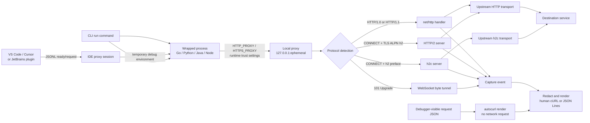

# Architecture

`autocurl` is an explicit, process-scoped forward proxy. It changes the
environment of one child process instead of changing application source or the
operating-system proxy.

## HTTPS interception

For each run, the proxy generates an in-memory root key and a 24-hour root
certificate. Leaf certificates are generated lazily per destination host. The
root certificate is written to a private temporary directory so the wrapped
runtime can trust it.

The proxy independently verifies the real upstream certificate. Trusting the
ephemeral root in the child process does not disable upstream certificate
validation.

No certificate is added to the system keychain. The temporary directory,
including the Java PKCS12 truststore, is removed when the command exits.

## Protocol selection

- A normal forward-proxy request is handled as HTTP/1.x.
- A `CONNECT` stream beginning with a TLS ClientHello is intercepted with a
  generated certificate. ALPN selects HTTP/2 or HTTP/1.1.
- A `CONNECT` stream beginning with the HTTP/2 client preface is treated as h2c.
- A classic WebSocket handshake stays HTTP/1.1 until the upstream returns 101;
  the proxy then relays both byte directions.

Client and upstream protocol negotiation are independent. An HTTP/1.1 client
may reach an HTTP/2 upstream, and an HTTP/2 client may reach an HTTP/1.1
upstream. Both versions are recorded.

## Capture lifecycle

Request bodies are copied through a bounded tee. The upstream receives the
original stream while `autocurl` retains at most `--max-body` bytes. Response
bodies are not retained.

For gRPC, the proxy preserves `TE: trailers`, streams response bytes with
flushing, forwards trailers, and records `grpc-status`. Protobuf frames are
treated as opaque binary data.

The `render` command bypasses the proxy. It accepts method, URL, headers, and
body values exported from a debugger, then calls the same redaction and cURL
renderer used by live events. It never sends the described request.

The `proxy` command exposes capture lifecycle to IDE adapters. Its first JSON
Line is a `ready` event containing generated environment overrides, never the
parent environment. Later lines are `request` events produced by the same
emitter as `run`. IDE adapters keep stdin open for session ownership; closing
it shuts down the proxy and deletes all ephemeral files.

## Known design boundaries

- Explicit proxy settings must be honored by the client library.
- TLS certificate pinning cannot work with local interception.
- HTTP/3 uses QUIC/UDP and does not pass through this TCP proxy.
- RFC 8441 WebSocket over HTTP/2 is different from HTTP/1.1 Upgrade and is not
  enabled in the current Go HTTP/2 stack.
