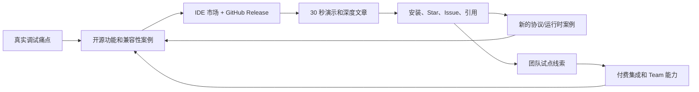

# Autocurl 技术影响力与商业化计划

这份计划的目标不是立刻把一个开发者工具“锁进付费墙”，而是先让 Autocurl
成为开发者遇到出站 HTTP 调试问题时会想到的工具，再把团队级的一致性、治理和
支持变成可持续收入。

## 一句话定位

> Autocurl 捕获代码真正发出的出站请求，并在 IDE 里生成可复制的完整 cURL；
> 不改业务代码，不改系统代理。

它不是另一个 API Client，也不是通用抓包器。它解决的是两者之间的空档：

- API Client 需要开发者重新手工构造请求；
- Charles、Proxyman、mitmproxy 等通用代理作用域更大，配置和筛选成本更高；
- IDE HTTP Client 可以发送请求，但不会自动还原业务代码最终发出的请求；
- 从源码或调试器变量生成 cURL 容易遗漏中间件、序列化、鉴权和动态配置。

Autocurl 的差异化是 **实际请求、进程级作用域、IDE 原生、多语言/多协议**。

## 应该坚持的开源边界

以下能力建议长期保持 MIT 开源和永久免费：

- 本机单人捕获与 cURL 生成；
- Go、Java、Python、Node.js 运行时支持；
- HTTP/1.1、HTTP/2、gRPC 和 WebSocket 基础支持；
- JetBrains、VS Code、Cursor 的个人工作流；
- 本地默认脱敏、Body 限制、目标绕过和 Safe 模式；
- CLI 与公开文件格式。

原因很直接：这些能力是传播入口，也是项目的可信度来源。如果个人开发者第一次
遇到付费墙，项目很难形成安装量、Issue、文章引用、贡献者和口碑。

团队付费层不应该卖“能不能抓到请求”，而应该卖：

- 团队统一配置；
- 安全与合规治理；
- 企业内分发；
- 协作和可复现性；
- SLA、集成和支持。

## 首要用户

### 开源传播用户

- Go、Java、Python、Node.js 后端开发者；
- 使用 JetBrains IDE、VS Code 或 Cursor；
- 经常调试微服务、网关和第三方 API；
- 今天的替代方案是手工拼 cURL、临时打日志或配置全局代理。

他们通常不会为单次捕获付费，但会贡献 Star、Issue、案例和内部传播。

### 第一付费用户

- 20–200 人研发团队中的平台工程、开发效率或基础架构负责人；
- 有统一 Header、网关诊断、脱敏、代理绕过和内部证书需求；
- 团队成员重复遇到“本地无法复现线上请求”“cURL 带出敏感字段”等问题；
- 可以用团队效率预算、开发者工具预算或支持服务预算采购。

### 企业用户

- 金融、医疗、电商、大型互联网等对数据和内网分发有要求的团队；
- 需要完全离线、自托管、RBAC、审计、签名分发和响应承诺；
- 采购周期长，但客单价和续费可能性更高。

## 收入策略

以下数字是用于验证意愿的起始报价，不是最终承诺价格。

### 1. Team 配置与治理订阅——首选长期模型

谁付费：平台工程、研发效能团队或工程经理。

提供：

- 版本化的共享脱敏规则和 Header 保留策略；
- Workspace/Repository 级捕获预设；
- 团队统一的 bypass、网关调试 Header 和 Body 限制；
- 私有模板库和可复现请求包；
- 团队内插件/引擎更新通道；
- 基础邮件或 Issue 支持。

建议验证价：

- `US$12/开发者/月` 或 `US$120/开发者/年`；
- 中国团队可先以 `¥69/开发者/月` 或年度团队包验证；
- 20 席起售，早期试点可以给 60 天免费期换取访谈和案例授权。

粗略单位经济：

- 早期获客主要来自 GitHub、IDE 市场和技术内容，现金 CAC 目标低于
  `US$100/团队`；
- 30 席年度合同约 `US$3,600`，目标毛利率高于 85%；
- 如果每月人工支持不超过 3 小时，单个团队可在首年内收回获客与支持成本；
- 年度续费目标高于 80%。

风险：

- 团队可能认为共享 YAML 足够，不愿为配置本身付费；
- 过早建设云端会分散对捕获质量的投入；
- 按席收费可能限制内部扩散。

低成本验证：

1. 官网保留“申请团队试点”入口；
2. 访谈 10 位平台工程/研发效能负责人；
3. 至少 3 家愿意提供真实脱敏/分发需求；
4. 至少 1 家接受带价格的试点意向。

继续投入标准：10 次访谈中至少 4 次明确表达团队治理痛点，并有 1 个付费试点。

### 2. Enterprise 自托管许可——首选高客单模型

谁付费：安全要求高的大型企业、私有网络和受监管团队。

提供：

- 完全自托管的策略和插件分发；
- SSO、RBAC、审计与策略签名；
- 离线安装包、内部 Marketplace/制品库集成；
- 兼容性认证矩阵、升级窗口和优先支持；
- 可选的定制协议、私有 CA 和网关集成。

建议验证价：

- `US$8,000–25,000/组织/年`；
- 国内以 `¥5万–20万/年` 的范围验证，取决于席位、支持和定制范围。

粗略单位经济：

- 目标毛利率 75% 以上；
- 单客户售前和首年支持控制在 5–15 个工作日；
- 销售周期预期 2–6 个月；
- 两个企业客户即可覆盖早期专职开发与支持的一部分成本。

风险：

- 企业需求容易把产品拖向大量一次性定制；
- 安全、法务和采购周期长；
- 单人维护时 SLA 风险高。

低成本验证：

- 做一页 Enterprise 能力说明，不先写管理后台；
- 找 5 位企业平台负责人做需求评审；
- 对“离线分发 + 签名策略 + 兼容性支持”给出真实报价；
- 没有付费设计伙伴之前，不投入 SSO/RBAC 等重功能。

继续投入标准：至少 2 家愿意进入方案评估，或 1 家支付设计伙伴费用。

### 3. 付费集成与支持——最快产生第一笔收入

谁付费：已经想在团队落地、但存在内网证书、私有网关、mTLS 或特殊客户端的团队。

提供：

- 1–2 周兼容性评估和落地；
- 私有网关 Header、证书、代理绕过和内部 Marketplace 集成；
- 团队培训、部署手册和升级方案；
- 明确边界的协议/客户端兼容性开发。

建议报价：

- 远程诊断：`¥3,000–8,000/次`；
- 小型团队试点：`¥10,000–30,000/项目`；
- 海外客户：`US$1,500–5,000/项目`。

粗略单位经济：

- 现金毛利率目标 60% 以上；
- 收入不是最可扩展，但能最快验证真正愿意付钱的问题；
- 每次集成都应沉淀为通用兼容性、文档或自动化测试，避免纯人力外包。

风险：

- 容易变成无限范围的技术支持；
- 定制代码可能无法开源或公开验证；
- 占用核心产品时间。

低成本验证：

- 在团队试点 Issue 中增加“希望获得付费集成支持”选项；
- 前 3 个项目只接受固定范围和固定周期；
- 结束后要求一段可匿名公开的效果说明。

继续投入标准：3 个试点中至少 2 个愿意为后续支持或团队能力续费。

### 4. GitHub Sponsors 与企业赞助——影响力辅助收入

谁付费：个人受益者、使用 Autocurl 的公司、开发者工具品牌。

提供：

- 项目持续维护；
- 公开 Roadmap 投票和 Sponsor 鸣谢；
- 企业 Logo 展示，但不影响技术判断和隐私；
- 可选的季度维护者交流。

建议档位：

- 个人：`US$5/月`、`US$15/月`；
- 企业：`US$250/月`、`US$1,000/月`。

粗略单位经济：毛利高，但通常要在项目已有稳定流量后才明显，不能作为首要收入
预测。

风险：流量不足时收入很低；过多 Logo 会削弱工具的专业感。

低成本验证：项目达到 200 Star 或 1,000 个市场安装后开放 Sponsor，并联系
3 家实际使用团队，不做广撒网投放。

### 5. 高质量技术内容与培训——个人品牌收入

谁付费：希望学习网络代理、IDE 插件、HTTP/2/gRPC 调试的开发者或企业。

形式：

- 深度文章、公开演讲和直播；
- 企业内部培训；
- 小课或代码工作坊；
- 咨询和招聘/合作机会。

建议报价：

- 公开内容免费，用于扩大技术影响力；
- 企业培训 `¥5,000–20,000/场`；
- 半天架构咨询 `¥3,000–10,000`。

风险：内容生产消耗时间，且可能与产品进度争夺注意力。

低成本验证：先连续发布 4 篇高质量文章，观察收藏、GitHub Referral 和演讲邀请，
再决定是否制作付费课程。

## 优先级

| 顺序 | 模型 | 现在为什么做 |
| --- | --- | --- |
| 1 | 付费集成与支持 | 最快验证真实付费问题，不需要先建设 SaaS |
| 2 | Team 配置与治理 | 与开源核心互补，是最自然的长期经常性收入 |
| 3 | Enterprise 自托管 | 客单价高，但只在出现设计伙伴后建设 |
| 4 | 技术内容与培训 | 直接放大作者影响力，并为前面三项获客 |
| 5 | Sponsors | 等流量形成后开启，作为维护收入而非主业务 |

短期最合理的组合是：**开源增长 + 固定范围的付费试点 + Team 需求验证**。

## 技术影响力增长飞轮

影响力不应该只看 Star。建议按下面顺序观察：

1. **发现**：GitHub 页面访问、官网访问、文章阅读、市场曝光；
2. **安装**：Release 下载、JetBrains/VS Code/Open VSX 安装；
3. **激活**：公开 Issue/访谈中确认用户成功复制第一条 cURL；
4. **留存**：重复版本下载、回访、长期 Issue 参与和团队内部推荐；
5. **商业**：团队试点申请、带预算访谈、付费集成和续费。

当前版本不应为了统计激活而加入请求遥测。先使用 GitHub Traffic、Release
下载量、市场安装量和自愿反馈，保持“请求永不离开本机”的信任定位。

## 内容主题：用工程难点建立作者品牌

不要只发“我做了一个工具”。最有传播力的是公开解决问题的过程：

1. 《为什么从源码手拼 cURL 总会漏字段》
2. 《零侵入捕获：如何只代理一个 Run/Debug 进程》
3. 《Go 在 macOS 上的证书验证为什么让本地 HTTPS 代理失效》
4. 《HTTP/2、gRPC 和 WebSocket 到底怎样变成可复现请求》
5. 《JetBrains Run Configuration 插件如何做到临时注入而不污染配置》
6. 《做一个开发者工具：从 CLI、IDE 插件到 Marketplace 自动升级》
7. 《一次 ECONNREFUSED 调试背后的 NO_PROXY 与进程网络边界》

每篇内容都使用同一结构：

- 一个具体失败现场；
- 原因的最小模型；
- 失败过的方案；
- Autocurl 的实现取舍；
- 可运行的公开示例；
- GitHub 和官网入口。

## 90 天执行计划

### 第 1–2 周：让第一次使用成功

- 上线官网、中英文 README 和明确的 30 秒演示；
- 完成 JetBrains、VS Code、Open VSX 首次市场上传；
- 录制一个不超过 45 秒的真实 POST Body 捕获 GIF/视频；
- 在 GitHub Discussions 或 Issue 中固定“Show & Tell / 使用案例”入口；
- 找 10 位同事或开源用户完成无指导安装测试。

成功标准：

- 8/10 能在 5 分钟内复制第一条 cURL；
- 至少覆盖 Go、Java、Python、Node.js 中的三种；
- 所有失败都转化为文档或自动诊断。

### 第 3–4 周：集中发布

- 同一天发布 GitHub、V2EX/掘金、知乎、X/LinkedIn、Hacker News/Reddit；
- 每个渠道使用不同角度，不复制同一篇硬广；
- 发布第一篇技术深文和 45 秒演示；
- 在官网和 Issue 中收集团队试点需求。

成功标准：

- 100 Star，或 500 个市场安装/Release 下载；
- 10 个来自非熟人的有效反馈；
- 3 个团队访谈。

### 第 2 个月：形成可重复内容

- 每两周一个兼容性版本或案例版本；
- 连续发布 3 篇实现文章；
- 增加公开兼容性矩阵和 Good First Issue；
- 邀请 3 位用户写匿名或公开使用案例；
- 对 Team 需求制作配置文件原型，不建设后台。

成功标准：

- 300 Star；
- 1,500 个累计安装/下载；
- 10 次团队访谈；
- 1 个愿意讨论价格的试点。

### 第 3 个月：拿到第一笔收入

- 签一个固定范围的付费集成或培训；
- 用真实需求定义 Team v0：共享策略、预设和内部分发；
- 公开开源/付费边界；
- 选择 1–2 个设计伙伴，不接受无限定制。

成功标准：

- 第一笔 `¥3,000+` 收入；
- 1 个付费试点或设计伙伴；
- 有明确证据决定继续、调整或停止 Team 产品。

## 本周就做

1. 用 `docs/launch-kit.zh-CN.md` 发布第一轮内容；
2. 完成三个 IDE 市场的首次人工上架；
3. 录制真实 Java 或 Go POST Body 的 45 秒演示；
4. 邀请 10 位目标用户完成安装，不做口头教学；
5. 对每位用户问三个问题：
   - 最近一次手工拼 cURL 是什么场景？
   - 哪一步最耗时或最容易错？
   - 如果团队能统一脱敏、Header 和绕过策略，谁会为它付费？
6. 每周公开一条进展：新兼容性、失败复盘或用户案例。

## 不要做

- 不要先开发账号、计费、云端同步和复杂管理后台；
- 不要在个人捕获能力上制造付费限制；
- 不要为了数据增长上传任何捕获请求或 Body；
- 不要用虚构客户、下载量、节省时间数字做宣传；
- 不要同时追求所有开发者，先服务后端和平台工程团队；
- 不要接受无法沉淀为通用能力的无限定制。

商业化的第一步不是写支付代码，而是找到愿意为**团队一致性、安全治理和落地
支持**付钱的人。
