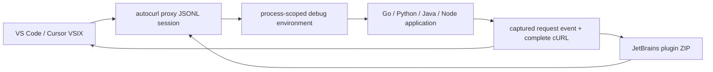

# IDE plugins

Autocurl uses one versioned Go engine and two thin IDE adapters:



This split keeps capture, TLS, redaction, HTTP/2, gRPC, WebSocket, and cURL
behavior identical across editors. IDE code owns only lifecycle, debug
environment injection, request presentation, clipboard, and settings.

## VS Code and Cursor

Install `autocurl-0.3.1.vsix` with
**Extensions: Install from VSIX...**. Cursor is based on the VS Code codebase,
so the same extension package is used.

Default workflow:

1. Start any normal debug launch.
2. The extension starts `autocurl --json proxy --lifetime-stdin`.
3. The engine emits a `ready` event.
4. The extension merges its generated environment into the debug
   configuration.
5. Captured requests appear under **Explorer → Autocurl Requests**.
6. Click a request to open its cURL, use the inline action to copy it, or press
   <kbd>Cmd</kbd>+<kbd>Alt</kbd>+<kbd>C</kbd> /
   <kbd>Ctrl</kbd>+<kbd>Alt</kbd>+<kbd>C</kbd> for the latest request.

Useful commands:

- **Autocurl: Start Capture**
- **Autocurl: Pause Recording / Resume Recording**
- **Autocurl: Stop Session**
- **Autocurl: Clear Requests**
- **Autocurl: Copy Last cURL**
- **Autocurl: Generate cURL from Request JSON**
- **Autocurl: Run Environment Check**
- **Autocurl: Download/Update Engine**

Important settings:

| Setting | Default | Meaning |
| --- | --- | --- |
| `autocurl.autoStartOnDebug` | `true` | Start capture before a debug launch |
| `autocurl.injectDebugEnvironment` | `true` | Merge process-scoped proxy/trust variables |
| `autocurl.binaryPath` | empty | Use a specific engine instead of managed/PATH lookup |
| `autocurl.autoDownload` | `true` | Download and SHA-256 verify the matching release |
| `autocurl.captureMode` | `safe` | Safe prioritizes compatibility; Strict forces interception |
| `autocurl.match` | empty | Show only URLs containing this value |
| `autocurl.method` | empty | Show only one HTTP method |
| `autocurl.replayHeaders` | `[]` | Add headers only to generated cURLs |
| `autocurl.liveHeaders` | `[]` | Inject headers into real traffic; use carefully |
| `autocurl.bypassTargets` | `[]` | Keep mTLS/direct infrastructure targets outside capture |
| `autocurl.expectedListenPorts` | `[]` | Diagnose service startup by checking localhost ports |
| `autocurl.startupDiagnosticSeconds` | `15` | Wait before port/proxy-traffic diagnostics |
| `autocurl.showSecrets` | `false` | Disable safe redaction |

The environment provider applies to IDE debug launches, including Run Without
Debugging when it goes through a debug adapter. A process launched in a
pre-existing integrated terminal cannot be changed retroactively.

### Package the VSIX

```bash
cd ide/vscode
npm ci
npm run package
```

Output: `ide/vscode/autocurl-0.3.1.vsix`.

`@vscode/vsce` runs TypeScript type checking and an esbuild production bundle
before creating the VSIX. Publishing to the Visual Studio Marketplace requires
a publisher and publishing credentials. Cursor users can install the same VSIX
directly; publishing it to Open VSX makes it available to Cursor's extension
marketplace after Cursor's synchronization and security checks. See the
[Chinese marketplace publication runbook](marketplace-publishing.zh-CN.md) for
the one-time account setup and automated tag workflow.

## JetBrains IDEs

The plugin supports IntelliJ Platform build 251 (2025.1) and newer. It uses
only platform APIs, so one ZIP serves IntelliJ IDEA, GoLand, PyCharm, WebStorm,
and other compatible products.

Install `autocurl-jetbrains-0.3.1.zip` with
**Settings → Plugins → ⚙ → Install Plugin from Disk**.

Default workflow:

1. Select an existing Run/Debug Configuration.
2. Choose **Run Selected with Autocurl** or
   **Debug Selected with Autocurl**.
3. The plugin creates a temporary copy, injects the session environment, and
   launches it with the normal IDE runner.
4. Open the **Autocurl** tool window to inspect and copy requests.

To verify the GoLand integration immediately, run
[`examples/go-http-client`](../examples/go-http-client/README.md). It sends a
GET with query parameters and a POST with a nested JSON body, both carrying
`get-info: true`.

The original configuration is not persisted with proxy values. Run
configurations use more than one environment interface. The plugin supports
both the common `getEnvs/setEnvs` interface and GoLand's
`getCustomEnvironment/setCustomEnvironment` interface. A specialized
configuration that exposes no environment map receives a warning containing
its concrete class name.

### mTLS and direct infrastructure dependencies

An explicit HTTPS/gRPC proxy must terminate TLS to inspect requests. It cannot
reuse a client's private key, so mTLS endpoints must remain end-to-end.
Configure hosts, IPs, domain suffixes, or CIDRs under **Settings → Tools →
Autocurl → Bypass capture**. The plugin applies them to `NO_PROXY`, `no_proxy`,
`no_grpc_proxy`, and Java `http.nonProxyHosts`, while preserving values already
present in the Run Configuration. Bypassed traffic is not captured.

The JetBrains plugin and the local engine are separate versioned components.
The plugin version shown under **Settings → Plugins → Autocurl** belongs to the
IDE adapter. The engine is a background proxy cached under the JetBrains cache
directory. Updating only the engine does not change the version shown on the
plugin page. When a fix touches both layers, install the new plugin and restart
the IDE; the plugin then verifies and updates its managed engine.

Use Autocurl 0.2.3 or newer for Go HTTPS capture on macOS. Version 0.2.1 could
reuse the 0.2.0 engine, while version 0.2.2 could miss the Go SDK when GoLand
was launched from the macOS GUI with a minimal `PATH`. Version 0.2.3 discovers
Go through `GOROOT`, standard installation locations, and the user's login
shell, requires the matching engine version, and passes the temporary overlay
to GoLand's build parameters so it participates in `go build`.

When a breakpoint is before send, copy the request JSON from Variables/Watches
and use **Generate cURL from Request JSON**. The plugin reads an editor
selection, then a JSON document, then the clipboard. When all are empty it
offers Go, Java, Python, Axios, and Fetch templates. Debugger values require
Copy Value because there is no generic IntelliJ debugger-variable API shared by
all language plugins.

### Package the JetBrains ZIP

Requires JDK 21 or lets the configured Foojay resolver provision it:

```bash
cd ide/jetbrains
./gradlew test buildPlugin verifyPluginStructure verifyPluginProjectConfiguration
```

Output:
`ide/jetbrains/build/distributions/autocurl-jetbrains-0.3.1.zip`.

For a faster local API check against an installed product:

```bash
AUTOCURL_LOCAL_IDE="/Applications/GoLand.app" \
  ./gradlew buildPlugin verifyPluginStructure verifyPluginProjectConfiguration
```

Marketplace publication uses `./gradlew publishPlugin` and the
`PUBLISH_TOKEN` environment variable. A JetBrains vendor profile, Marketplace
agreement, listing metadata, and JetBrains review are required before the
public listing becomes available. JetBrains requires the first version to be
uploaded manually; subsequent tagged releases are handled by the repository's
marketplace workflow. See the
[marketplace publication runbook](marketplace-publishing.zh-CN.md).

## Engine download and trust

Both plugins resolve the engine in this order:

1. explicitly configured path;
2. previously managed download;
3. `autocurl` on `PATH`;
4. latest compatible GitHub Release.

Downloads are selected by operating system and CPU architecture, and the
archive SHA-256 must match `SHA256SUMS`. The IDE package requires its matching
engine version so runtime fixes cannot be bypassed by a stale managed binary.

The `ready.environment` object contains generated overrides only. Parent
environment variables and their secrets are never serialized into the JSON
protocol. `GOFLAGS` and `JAVA_TOOL_OPTIONS` are marked as append-only so an IDE
preserves values already present in the Run/Debug Configuration.

Pause Recording suppresses new rows while the proxy keeps forwarding. Stop
Session terminates associated Run/Debug processes before it closes engine
stdin and removes the ephemeral CA, Java truststore, and Go overlay. Clear only
empties the list.

## Current integration boundary

IDE plugins cannot reconstruct variables that the debugger does not expose,
and a proxy cannot capture a request that has not been sent. The two supported
paths are therefore:

- actual send: start through the IDE integration and capture the wire request;
- paused before send: provide visible request JSON to the offline renderer.

Certificate-pinned clients, clients that ignore all explicit proxy settings,
HTTP/3/QUIC, semantic protobuf decoding, and WebSocket message capture retain
the same boundaries documented in the main README.
