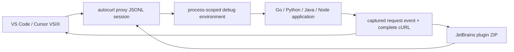

# IDE plugins

Autocurl uses one versioned Go engine and two thin IDE adapters:



This split keeps capture, TLS, redaction, HTTP/2, gRPC, WebSocket, and cURL
behavior identical across editors. IDE code owns only lifecycle, debug
environment injection, request presentation, clipboard, and settings.

## VS Code and Cursor

Install `autocurl-0.2.0.vsix` with
**Extensions: Install from VSIX...**. Cursor is based on the VS Code codebase,
so the same extension package is used.

Default workflow:

1. Start any normal debug launch.
2. The extension starts `autocurl --json proxy --lifetime-stdin`.
3. The engine emits a `ready` event.
4. The extension merges its generated environment into the debug
   configuration.
5. Captured requests appear under **Explorer → Autocurl Requests**.
6. Click a request to open its cURL, use the inline action to copy it, or press
   <kbd>Cmd</kbd>+<kbd>Alt</kbd>+<kbd>C</kbd> /
   <kbd>Ctrl</kbd>+<kbd>Alt</kbd>+<kbd>C</kbd> for the latest request.

Useful commands:

- **Autocurl: Start Capture**
- **Autocurl: Stop Capture**
- **Autocurl: Copy Last cURL**
- **Autocurl: Render Selected Request JSON**
- **Autocurl: Download/Update Engine**

Important settings:

| Setting | Default | Meaning |
| --- | --- | --- |
| `autocurl.autoStartOnDebug` | `true` | Start capture before a debug launch |
| `autocurl.injectDebugEnvironment` | `true` | Merge process-scoped proxy/trust variables |
| `autocurl.binaryPath` | empty | Use a specific engine instead of managed/PATH lookup |
| `autocurl.autoDownload` | `true` | Download and SHA-256 verify the matching release |
| `autocurl.match` | empty | Show only URLs containing this value |
| `autocurl.method` | empty | Show only one HTTP method |
| `autocurl.replayHeaders` | `[]` | Add headers only to generated cURLs |
| `autocurl.liveHeaders` | `[]` | Inject headers into real traffic; use carefully |
| `autocurl.showSecrets` | `false` | Disable safe redaction |

The environment provider applies to IDE debug launches, including Run Without
Debugging when it goes through a debug adapter. A process launched in a
pre-existing integrated terminal cannot be changed retroactively.

### Package the VSIX

```bash
cd ide/vscode
npm ci
npm run package
```

Output: `ide/vscode/autocurl-0.2.0.vsix`.

`@vscode/vsce` runs TypeScript type checking and an esbuild production bundle
before creating the VSIX. Publishing to the Visual Studio Marketplace requires
a publisher and access token. Cursor users can install the same VSIX directly;
an Open VSX publication can be added after the listing identity is reserved.

## JetBrains IDEs

The plugin supports IntelliJ Platform build 251 (2025.1) and newer. It uses
only platform APIs, so one ZIP serves IntelliJ IDEA, GoLand, PyCharm, WebStorm,
and other compatible products.

Install `autocurl-jetbrains-0.2.0.zip` with
**Settings → Plugins → ⚙ → Install Plugin from Disk**.

Default workflow:

1. Select an existing Run/Debug Configuration.
2. Choose **Run Selected with Autocurl** or
   **Debug Selected with Autocurl**.
3. The plugin creates a temporary copy, injects the session environment, and
   launches it with the normal IDE runner.
4. Open the **Autocurl** tool window to inspect and copy requests.

The original configuration is not persisted with proxy values. Run
configurations implementing IntelliJ's standard environment interface are
supported; this covers the common Java, Go, Python, Node.js, and build-tool
configurations. A specialized configuration that exposes no environment map
will receive an explicit warning.

When a breakpoint is before send, select request JSON in an editor and use
**Render Selected Request JSON as cURL**. The entire JSON document is used when
there is no selection.

### Package the JetBrains ZIP

Requires JDK 21 or lets the configured Foojay resolver provision it:

```bash
cd ide/jetbrains
./gradlew buildPlugin verifyPluginStructure verifyPluginProjectConfiguration
```

Output:
`ide/jetbrains/build/distributions/autocurl-jetbrains-0.2.0.zip`.

For a faster local API check against an installed product:

```bash
AUTOCURL_LOCAL_IDE="/Applications/GoLand.app" \
  ./gradlew buildPlugin verifyPluginStructure verifyPluginProjectConfiguration
```

Marketplace publication uses `./gradlew publishPlugin` and the
`PUBLISH_TOKEN` environment variable. A JetBrains vendor profile, Marketplace
agreement, listing metadata, and JetBrains review are required before the
public listing becomes available.

## Engine download and trust

Both plugins resolve the engine in this order:

1. explicitly configured path;
2. previously managed download;
3. `autocurl` on `PATH`;
4. latest compatible GitHub Release.

Downloads are selected by operating system and CPU architecture, and the
archive SHA-256 must match `SHA256SUMS`. The engine must report version 0.2.0
or newer.

The `ready.environment` object contains generated overrides only. Parent
environment variables and their secrets are never serialized into the JSON
protocol. `GOFLAGS` and `JAVA_TOOL_OPTIONS` are marked as append-only so an IDE
preserves values already present in the Run/Debug Configuration.

Stopping capture closes engine stdin. The engine then shuts down its proxy and
deletes the ephemeral CA, Java truststore, and Go overlay.

## Current integration boundary

IDE plugins cannot reconstruct variables that the debugger does not expose,
and a proxy cannot capture a request that has not been sent. The two supported
paths are therefore:

- actual send: start through the IDE integration and capture the wire request;
- paused before send: provide visible request JSON to the offline renderer.

Certificate-pinned clients, clients that ignore all explicit proxy settings,
HTTP/3/QUIC, semantic protobuf decoding, and WebSocket message capture retain
the same boundaries documented in the main README.
