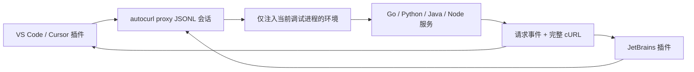

# IDE 插件使用、打包与发布

Autocurl 采用“一套 Go 核心、两个薄插件”的结构：



HTTP/2、gRPC、WebSocket、TLS、脱敏和 cURL 生成都在同一个 Go 引擎中实现。
IDE 插件只负责开始/停止、注入调试环境、展示请求和复制。

## VS Code / Cursor

安装 `autocurl-0.2.0.vsix` 后，默认直接按 F5：

1. 插件自动启动后台捕获会话。
2. 在调试程序启动前注入临时代理和证书环境。
3. 请求出现在 **Explorer → Autocurl Requests**。
4. 点击请求查看 cURL，点击右侧按钮复制。
5. 停止捕获后，临时代理和 CA 自动删除。

常用命令：

- **Autocurl: Start Capture**
- **Autocurl: Stop Capture**
- **Autocurl: Copy Last cURL**
- **Autocurl: Render Selected Request JSON**
- **Autocurl: Download/Update Engine**

常用配置：

| 配置 | 默认值 | 作用 |
| --- | --- | --- |
| `autocurl.autoStartOnDebug` | `true` | Debug 前自动开始捕获 |
| `autocurl.injectDebugEnvironment` | `true` | 注入当前调试进程 |
| `autocurl.binaryPath` | 空 | 指定本地引擎路径 |
| `autocurl.autoDownload` | `true` | 自动下载并校验 Release |
| `autocurl.match` | 空 | 只显示 URL 包含该文本的请求 |
| `autocurl.method` | 空 | 只显示指定方法 |
| `autocurl.replayHeaders` | `[]` | 只给生成的 cURL 增加 Header |
| `autocurl.liveHeaders` | `[]` | 给真实请求增加 Header，谨慎使用 |
| `autocurl.showSecrets` | `false` | 关闭脱敏，不建议 |

打包：

```bash
cd ide/vscode
npm ci
npm run package
```

产物：`ide/vscode/autocurl-0.2.0.vsix`。

发布 VS Code Marketplace 需要创建 publisher 和 token。Cursor 使用相同的
VS Code 扩展格式，可以直接安装 VSIX；后续可以再发布到 Open VSX。

## IntelliJ IDEA / GoLand / PyCharm / WebStorm

插件支持 2025.1（build 251）及以上版本。

安装 ZIP 后：

1. 选择一个已有的 Run/Debug Configuration。
2. 点击 **Run Selected with Autocurl** 或
   **Debug Selected with Autocurl**。
3. 插件创建临时配置、注入环境并用 IDE 原生 Runner 启动。
4. 在 **Autocurl** Tool Window 查看、选择、复制请求。

原始 Run Configuration 不会被写入代理配置。常见 Java、Go、Python、
Node.js、Gradle 等配置都提供标准环境变量接口；极少数自定义配置不提供时，
插件会明确提示，而不是静默启动后抓不到请求。

断点在发送之前时，选中请求 JSON，右键执行
**Render Selected Request JSON as cURL**。没有选区时会读取整个当前文档。
这个操作不发网络，只生成并复制 cURL。

打包：

```bash
cd ide/jetbrains
./gradlew buildPlugin verifyPluginStructure verifyPluginProjectConfiguration
```

产物：
`ide/jetbrains/build/distributions/autocurl-jetbrains-0.2.0.zip`。

使用本机 IDE 快速验证：

```bash
AUTOCURL_LOCAL_IDE="/Applications/GoLand.app" \
  ./gradlew buildPlugin verifyPluginStructure verifyPluginProjectConfiguration
```

发布 JetBrains Marketplace 使用 `./gradlew publishPlugin`，通过环境变量
`PUBLISH_TOKEN` 提供凭据。公开上架还需要 JetBrains vendor profile、协议、
商店资料和人工审核。

## 引擎自动下载与安全

插件按以下顺序查找引擎：

1. 手动配置路径；
2. IDE 托管目录中已经下载的版本；
3. `PATH` 中的 `autocurl`；
4. GitHub 最新兼容 Release。

下载时按 macOS/Linux/Windows 与 amd64/arm64 选择压缩包，并核对
`SHA256SUMS`。要求引擎版本不低于 0.2.0。

IDE 协议的 `ready.environment` 只包含新生成的覆盖值，不会把 IDE 父进程的
环境变量或密钥输出到 JSON。`GOFLAGS` 和 `JAVA_TOOL_OPTIONS` 标记为追加，
避免覆盖用户原有配置。

插件停止时关闭引擎 stdin；引擎关闭代理并删除临时 CA、Java truststore 和
Go overlay。不会修改系统代理或系统钥匙串。

## 必须说清楚的边界

- 请求真正发出：通过插件启动 Run/Debug，捕获真实请求。
- 断点停在发送之前：使用编辑器里能看到的完整请求 JSON 离线生成。
- 已经运行的进程无法在事后补加代理环境。
- 如果只有 body，没有 URL 和 Header，插件无法凭空推断。
- 证书固定、完全忽略代理的自定义客户端、HTTP/3、WebSocket 消息帧和
  protobuf 语义解析仍受主 README 中的限制。
