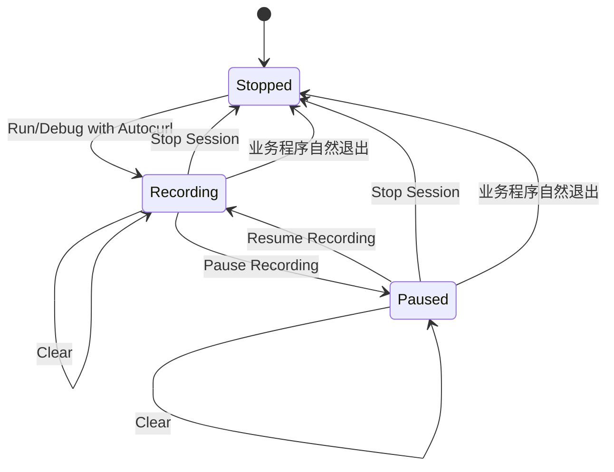

# IDE 会话生命周期

Autocurl 0.3.0 将“是否记录”“业务进程是否运行”“列表是否保留”拆成三个独立
状态，避免关闭代理后业务进程仍指向失效端口。

## Pause Recording

- 只停止把新请求写入捕获列表；
- 本地代理仍运行并继续转发；
- 业务进程不停止；
- 临时 CA 和进程级代理仍有效；
- Resume 后继续记录新请求。

它适合减少噪音，不能用于“解除业务进程代理”。

## Stop Session

IDE 插件按顺序执行：

1. 停止由本次 Autocurl 会话启动的 Run/Debug 进程；
2. 等待进程退出；
3. 关闭代理；
4. 删除临时 CA、Java truststore 和 Go overlay。

这样业务进程不会继续携带一个已经关闭的代理地址。若 IDE 无法优雅终止目标，
插件等待后会终止代理，并在 Run/Debug 控制台保留退出信息。

## Clear

- 只清空 IDE 中的请求列表和当前详情；
- 不停止业务程序；
- 不停止代理；
- 不删除临时证书；
- 不改变 Pause/Recording 状态。

## 业务程序自然退出

当插件识别到本次关联的最后一个 Run/Debug 进程结束时，会自动关闭捕获引擎并
清理临时文件。它不会停止其他普通 Run/Debug 配置，也不会修改原配置。

## 安全边界

- 代理只监听 `127.0.0.1` 随机端口；
- 环境变量只合并进临时 Run/Debug 配置；
- 系统代理和系统钥匙串不变；
- `ready.environment` 只包含 Autocurl 生成的覆盖值，不回传 IDE 父进程环境；
- Bypass 目标端到端直连，因而不会进入捕获列表；
- 默认对 Header、Query、JSON 和表单中的常见敏感字段脱敏。
